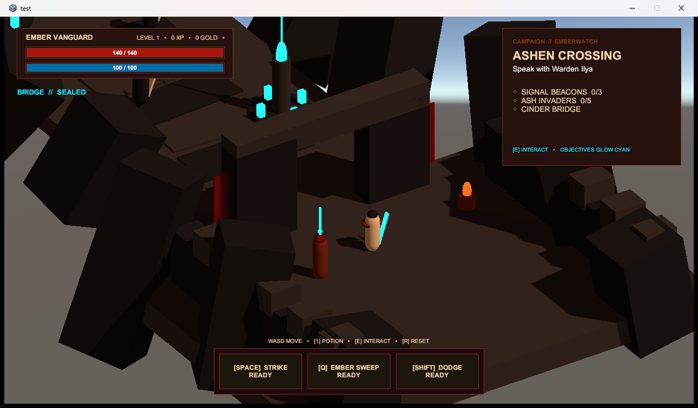
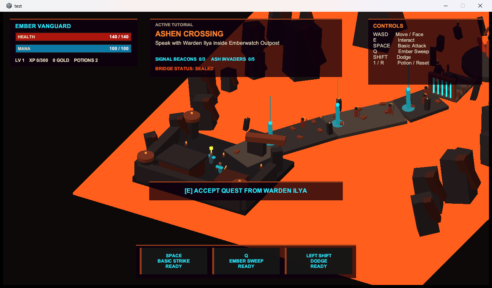

# Ashen Crossing multi-agent benchmark

This directory freezes the 2026-08-30/31 paired HoneyBee versus direct Codex experiment. It keeps
the specification, exact agent prompts, compact machine-readable evidence, and full-resolution
Player captures without committing the generated Unity projects, Library caches, or Player builds.

## Product decision

Continue investing in the HoneyBee Desktop workflow.

The visual results are preference-dependent, so this trial does **not** declare a visual-quality
winner. That does not block the product decision: an AI agent is an operator-controlled tool, and
the measured wall-time reduction is valuable even when a human remains responsible for direction,
selection, and final polish.

In this one warm trial, HoneyBee reached the objective compile/test/build/runtime gates in
**10m 47.50s**. Direct Codex reached its **27m 01.01s** cap without a final response, tests, or a
README. HoneyBee therefore reached the accepted objective state at least **16m 13.51s earlier**,
using 60.1% less wall time.

## What the result does and does not prove

The result supports a product-level claim: HoneyBee can reduce operator waiting time on a large,
well-partitioned task.

It does not support an intrinsic multi-agent quality claim. In the same-adapter controlled lane,
the four-agent topology took 9m 17.84s end to end and failed compilation, while the single owner
took 5m 38.71s and passed 41/41 tests. The current value is fast orchestration under human
supervision, not automatic quality superiority.

## Outcome

| Condition                                  | Implementation wall |              Tests | Build/runtime               | Verdict               |
| ------------------------------------------ | ------------------: | -----------------: | --------------------------- | --------------------- |
| Controlled multi: 3 builders + final owner |           9m 17.84s | blocked by compile | no build                    | hard fail             |
| Controlled single through HoneyBee adapter |           5m 38.71s |              41/41 | pass/pass                   | objective pass        |
| HoneyBee product Apply path                |          10m 47.50s |              39/39 | pass/pass                   | objective pass        |
| Direct Codex                               |      27m 01.01s cap |                0/0 | pass/pass from capped files | hard fail: incomplete |

The direct artifact was externally buildable and its autoplay contract worked, but accepting it as
complete would erase the explicit 30-test floor and documentation requirement. No condition
received a harness source correction after its stopping point.

## Visible artifacts

The captures use the same 1280x720 windowed launch and exact-window capture procedure. They are
shown for inspection, not scored here.

| HoneyBee product path                         | Direct Codex at cap                       |
| --------------------------------------------- | ----------------------------------------- |
|  |  |

The controlled single capture is also retained at
[`evidence/controlled-single.png`](evidence/controlled-single.png). The original randomized ballot
and sealed identity map remain under [`blind/`](blind/) so the experiment record is not rewritten
after the human decision.

## Capacity trade-off

Persistent output capacity was effectively the same:

| Measurement                            |        HoneyBee |    Direct Codex |
| -------------------------------------- | --------------: | --------------: |
| Final Unity project logical size       | 2,040,603,413 B | 2,039,835,350 B |
| Win64 Player build size                |   101,165,367 B |   101,175,905 B |
| Peak generation disk delta             |   144,187,392 B |   279,613,440 B |
| Peak app working set                   | 2,112,040,960 B |             n/a |
| Peak provider/process-tree working set | 2,045,353,984 B | 1,399,328,768 B |

The project totals differ by less than 0.8 MB and are dominated by Unity Library caches; Player
builds differ by about 10 KB. HoneyBee used less transient disk in this run. RAM is the real cost:
HoneyBee's independently sampled app and provider peaks create an upper envelope near 4.16 GB,
versus a 1.40 GB direct process tree. The two HoneyBee peaks must not be read as a measured
simultaneous sum.

## Multi-agent utilization and integration loss

HoneyBee used three parallel specialist builders followed by one serial final owner. The builder
phase consumed 613.87 agent-seconds in 300.78 wall-seconds. Presentation applied successfully, but
Systems and Runtime were rejected with global `<source-manifest>` conflicts even though ownership
paths were disjoint. The final owner reimplemented the missing areas.

That rejected 313.09 agent-seconds, roughly 51% of builder compute. The timing win survived the
waste, but the next Desktop iteration should make this failure visible and avoidable rather than
depending on a final agent to hide it.

## Desktop follow-up priorities

1. Compose verified patches by owned path or explicit dependency DAG instead of one global source
   manifest.
2. Require the final owner to pass an external compile and test gate before a Run can present a
   successful result.
3. Show applied, rejected, conflicted, and superseded Work outputs directly in Run detail, including
   wasted agent time and storage.
4. Make fresh-project storage installation idempotent. This trial's two new-profile attempts each
   waited about 125 seconds and failed with `workspace-storage.install-failed`, requiring a disclosed
   existing-profile staging workaround.
5. Repeat the same paired protocol at least five times after those fixes; retain human visual review
   separately from objective acceptance gates.

## Reproducibility boundary

- Unity: `6000.3.10f1`
- HoneyBee runtime/API: `0.6.0` / `1`
- Codex app-server: `0.146.0`
- Shared reference SHA-256:
  `962c878975e014fbbaab358d5bf63ce0e33ae4be351f185acc9df6448194ab46`
- Normalized baseline manifest SHA-256:
  `c85d40278100470c9e48fcde43b8a27ec0221a740b94ddef59350b74ead24a6d`
- Tested packaged `HoneyBee.exe` SHA-256:
  `78f9939dc3baf7f2ad2bc7f93f1424388102cb26d37c13f6764538057d935ee4`
- Repository HEAD present during the run:
  `b3204e02c8d5792a4eb6311537bd822fc36deae5`

The packaged Desktop came from a non-clean local working tree. The executable digest is therefore
the authoritative tested-binary identity; the Git commit alone cannot reproduce that package. This
is a limitation of the trial and a reason to bind future dogfood sessions to a clean commit and
package digest before launch.

## Evidence map

- [`FULL_REPORT.md`](FULL_REPORT.md): detailed interpretation and all measured tables
- [`BENCHMARK_SPEC.md`](BENCHMARK_SPEC.md): fixed workload and acceptance gates
- [`EXPERIMENT_PROTOCOL.md`](EXPERIMENT_PROTOCOL.md): paired-run protocol
- [`prompts/`](prompts/): exact specialist, final-owner, and single-owner instructions
- [`common/ashen-crossing-concept.png`](common/ashen-crossing-concept.png): shared concept input
- [`raw/metrics.json`](raw/metrics.json): compact canonical metrics
- [`decision.json`](decision.json): post-review human product decision
- [`raw/`](raw/): monitor summaries, Unity XML, marker summaries, and setup observation

This is one paired observation, not a statistical performance claim.
